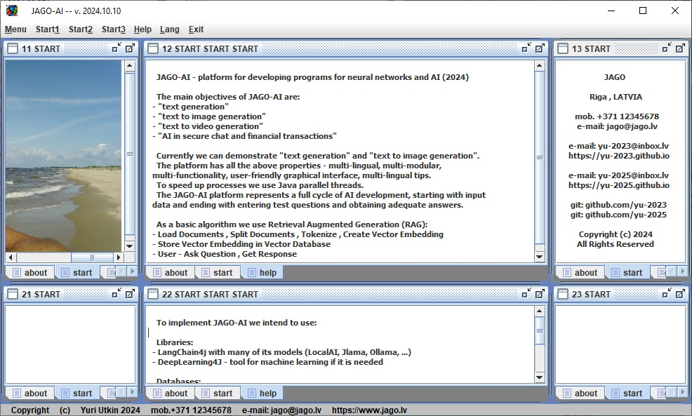

# JAGO-AI - platform for developing programs for neural networks and AI (2024)

The main objectives of JAGO-AI are "text generation" , "text to image generation" ,
"text to video generation" and using "AI in secure chat and financial transactions".

Currently we can demonstrate "text generation" and "text to image generation".

The platform has all the above properties - multi-lingual, multi-modular,
multi-functionality, user-friendly graphical interface, multi-lingual tips.

To speed up processes we use Java parallel threads.

The JAGO-AI platform represents a full cycle of AI development, starting with input
data and ending with entering test questions and obtaining adequate answers.

As a basic algorithm we use Retrieval Augmented Generation (RAG):
- Load Documents , Split Documents , Tokenize , Create Vector Embedding
- Store Vector Embedding in Vector Database
- User - Ask Question , Get Response

To implement JAGO-AI we intend to use:

Libraries:
- LangChain4j with many of its models (LocalAI, Jlama, Ollama, ...)
- DeepLearning4J - tool for machine learning if it is needed

Databases:
- Neo4j - vector database with its own declarative graph query language Cypher

Large Language Models LLM:
- From HuggingFace database with many of its local LLM models

Telegram (Money API) (AI chatbots) (translate text-to-text) (translate audio-to-audio)

<html>
  <body>
  
  <head>
 </head>
  
<table border="0">
  <tr>
    <td></td>
  </tr>
</table>

<table border="0">
  <tr>
    <td></td>
  </tr>
</table>

  </body>
</html>
